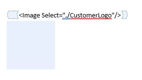
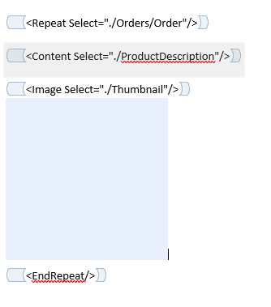
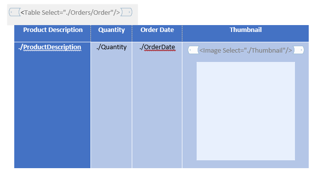

# Key highlights from [#31](https://github.com/sergey-tihon/Clippit/pull/31#issuecomment-874335292)

1. Image can be provided either by base64-encoded string or by specifying the filename. The Assembler will have to figure out the image type, based on either MIME or file extension. Here are both examples:

  - `<Logo>../../md-logo.png</Logo>`
  - `<Image>data:image/jpg;base64,/9j/4AAQSkZJRgABAQEAYABgAAD/2wBDAAgGBgcGBQgHBwcetc…</Image>`

2. The image content control will be surrounded by new type of select (in similar to repeat or conditional) – `Image Select` and `EndImage`. I found this approach easier than dealing just with the image content control. Here is the example:

3. When used in repeated context, the image is used with relative XPath (in similar to other fields):

4. Very similar situation with the Table:

5. Here is example of data xml file:

6. There is still a lot to be improved and some issues to be resolved, such as using templated image in header/footer, managing image size (preserve original/modify based on template/maintain aspect ratio etc.)

7. Samples can be found in `DocumentAssemblerTests.cs` merged in [#31](https://github.com/sergey-tihon/Clippit/pull/31)